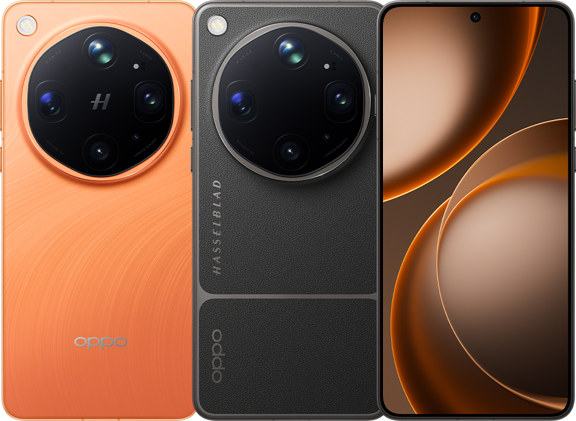

Beskrivelse av hvordan jeg har løst oppgaven :
Jeg startet første med å lage oppsettet med index.html, ordre.html, asset mappen, styles.css.
Jeg startet med å sette opp index.html struktruren ogog fortsatte etter på med order.html. Jeg laget linken til styles.css inn i begge html filene.
Bildet  hentet ved å google: https://www.google.com/search/about-this-image?img=H4sIAAAAAAAA_wEXAOj_ChUIzPLoweOG5NItENrUwMrMoPjM0wFo336pFwAAAA%3D%3D&q=https://www.oppo.com/no/smartphones/series-find-x/find-x9-ultra/specs/&ctx=iv&hl=no-NO
